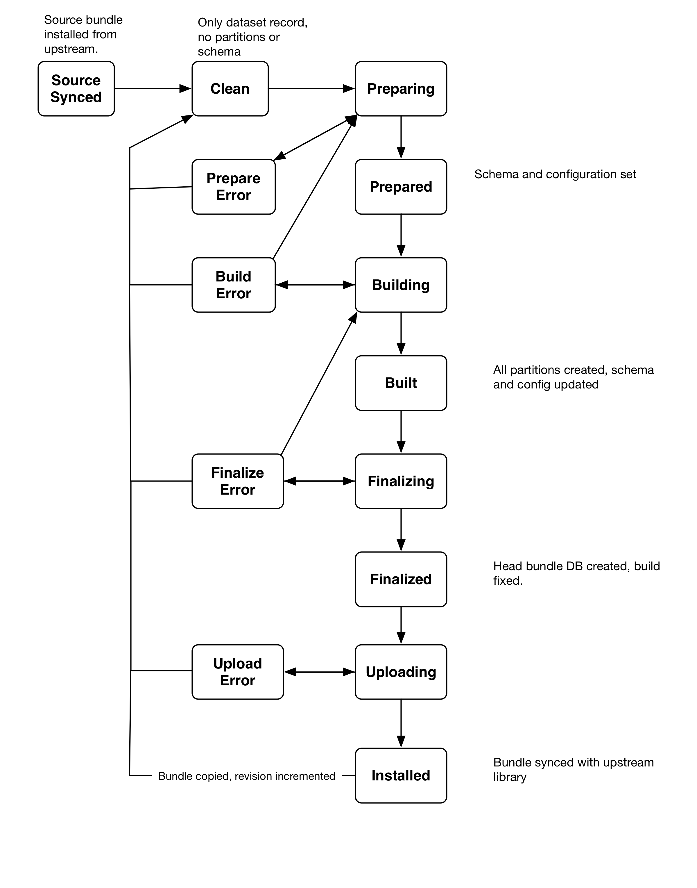

.. _design_bundle_states:

Bundle Lifecycle and States
===========================

Bundles can be installed, built, prepared and uploaded, and as these operations are performed, the bundle transitions through a variety of states. 

These states can be grouped into major phases of a bundle's lifecycle: 

- Source installed. A source bundle, a bundle with just metadata and source files, has been installed in teh library. 
- Clean. The source bundle has been stripped of schema and parittions, in preparation for building. 
- Building. The bundle process involved preparing, bundling and finalizing the bundle. 
- Uploading. A finalized bundle can be uploaded to a remote library. 
- Installed. An installed bundle is syncrhonisze with a remote library, either because the bundle was downloaded from the remote, or it was uploaded to the remote. 

And installed bundle can be copied to a new source bundle, with an incremented revision, to complete the cycle. 

- sourcesynced
- clean
- preparing
- prepareerror
- prepared
- building
- builderror
- built
- finalizing
- finalizeerror
- finalized
- uploading
- installed
